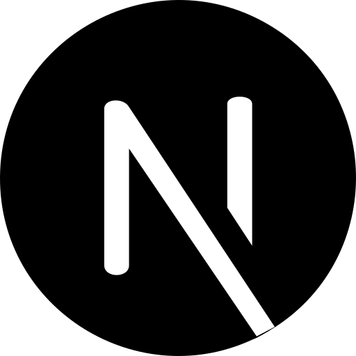

## Hi 👋, I'm [Amr Ibrahim]()

 

- 🔭 I’m currently working at [VMware](https://https://vmware.com/)
- 🌱 I’m currently learning **everything i need**

### Connect with me

   )

 

### Technology Stack:

         

 
 

 <!--  -->

